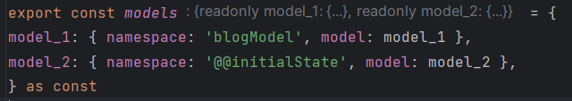
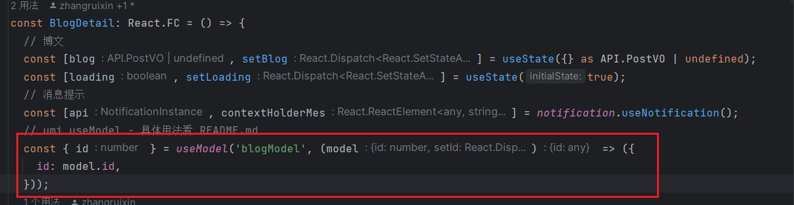

# 7122 Team-Blog

## umi useModel 的使用

如果我们需要提取的逻辑和状态都希望能够在多个组件中『共享』，就像其他数据流管理工具（dva, mobx）一样，@umijs/plugin-model 就是一个不错的选择。

### 参考官方文档

> umi-4 官方文档：https://umijs.org/docs/tutorials/getting-started

https://pro.ant.design/zh-CN/docs/simple-model/

https://v3.umijs.org/zh-CN/plugins/plugin-model#usemodel

### 1. 声明变量

`src/.umi/plugin-model/model.ts` 新增变量 such as: 

> 比如这个`blogModel`

### 2. 启用

启用方式： `src/models` 目录下有 hooks model 时启用。

### 3. 投入消费

useModel 有两个参数，namespace 和 updater。

- namespace - 就是 hooks model 文件的文件名，如上面例子里的 useAuthModel
- updater - 可选参数。在 hooks model 返回多个状态，但使用组件仅引用了其中部分状态，并且希望仅在这几个状态更新时 rerender 时使用（性能相关）。
